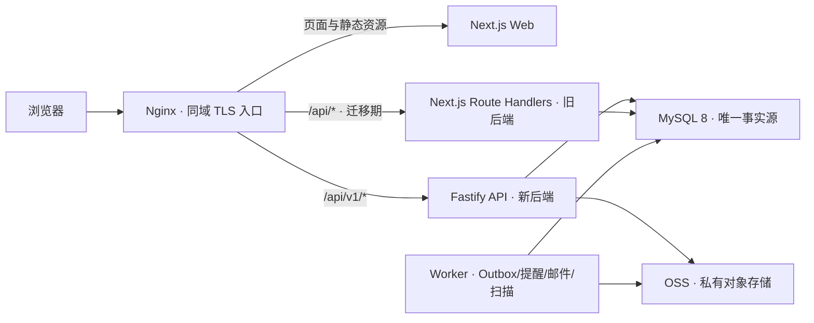

# 前后端分离与生产化重构总览

> 文档状态：重构准备基线 v1
> 代码基线：`607cb1c`（`chore: establish initial project baseline`）
> 规划分支：`codex/refactor-planning`
> 本轮边界：只定义业务基线、目标架构、迁移路线与生产门禁，不修改业务代码、不推送、不部署。

## 1. 结论先行

当前项目不是“只有前端的空壳”，而是一个 **Next.js 全栈单体**：前端页面、34 个 API Route 文件、60 个 HTTP Handler、约 4,462 行路由代码、84 张业务表模型和阿里云部署脚本都在同一仓库中。它已经覆盖供应链主流程的大部分概念，但整体成熟度是“可运行原型 + 部分真实业务闭环”，还不能按生产系统验收。

当前代码实现集中在成品、辅料和配件的采购到付款协同；仓库中尚未实现完整 MES、总账/网银、销售预测或承运商轨迹能力。**这只能证明当前实现范围，不能替代 Sponsor 对目标产品范围的批准**；是否明确排除这些能力列为 D-00 决策。

本次重构的推荐目标已经确认：

- 保留现有 React/Next.js 前端，逐步将其收敛为独立 Web 应用。
- 新建 Fastify + TypeScript 后端，继续使用 Drizzle，但以 MySQL 8 为唯一生产数据模型。
- 新建独立 Worker，承接 Outbox、提醒、邮件、效期扫描和文件异步处理。
- Nginx 保持浏览器同域访问：`/api/v1/*` 转发新后端，旧 `/api/*` 暂留 Next.js。
- 采用 Strangler（绞杀式）迁移；同一个业务写命令在任一时刻只有一个写入者，由新旧后端共同校验服务端 writer epoch/fence，不能只靠前端开关或 Nginx 路由。
- 首先修复安全和账实一致性 P0，再迁模块；不以“接口已搬家”冒充“生产可用”。

## 2. “前后端分离”在本项目中的定义

本项目的目标不是立即使用两个跨站域名，而是同时实现以下边界：

1. **源码边界**：Web 不再导入数据库、服务端密钥或领域持久化代码；API 不依赖 React/Next 页面生命周期。
2. **进程边界**：Web、API、Worker 可独立构建、启动、扩缩和回滚。
3. **契约边界**：OpenAPI/运行时 Schema 是接口事实源，前端只使用生成或封装的 TypeScript Client。
4. **权限边界**：身份、角色、组织数据范围、Step-up 与审计都由后端强制；隐藏菜单不算授权。
5. **发布边界**：前后端可独立发布，但通过版本化契约保持兼容。
6. **数据边界**：只有后端拥有数据库写权限；Worker 通过受控端口或同一应用层规则处理异步任务。

迁移期保持同域是刻意选择。当前会话 Cookie 使用 `HttpOnly; Secure; SameSite=Strict`（`app/lib/sessions.ts:15-17`），若先改成跨站部署，会同时引入 Cookie、CORS、CSRF 和凭证携带改造，放大风险。物理分进程不等于必须跨站。

## 3. “生产可用”在本项目中的定义

只有同时满足下列四类证据，才能宣称生产可用：

| 维度 | 必须回答的问题 | 证据形式 |
| --- | --- | --- |
| 业务闭环 | 正常链路和异常链路是否都能完成，账、货、状态是否一致？ | 真实角色 UAT、状态机测试、对账结果 |
| 安全边界 | 能否冒充用户、越权、绕过短信复核或重放高风险命令？ | 权限矩阵测试、负向安全测试、审计记录 |
| 工程质量 | 迁移、并发、失败重试和版本兼容是否可重复验证？ | MySQL 集成/并发测试、契约测试、CI 门禁 |
| 运行保障 | 故障能否被发现、回滚和恢复，责任人能否及时处理？ | SLO/告警、不可变制品、恢复演练、Runbook |

“页面能打开”“接口返回 200”“部署脚本存在”都只是局部证据，不能单独代表生产可用。

## 4. 当前最重要的事实

### 4.1 已有基础

- Node.js 22、TypeScript、Next.js、React、Drizzle、MySQL/OSS 适配和 Docker/Nginx 部署骨架已经存在（`package.json`、`infrastructure/aliyun/`）。
- 主数据、供应商、采购、生产、库存、发货、退货、财务、审批、审计等领域均已有表或 API。
- 会话 Token 使用高熵随机值且数据库保存哈希，密码采用 PBKDF2，Cookie 已设置 HttpOnly/Secure/SameSite。
- 部分库存扣减已使用事务和条件更新思路，容器也具备非 root、只读根文件系统等基础加固。
- 项目文档已经主动区分“需求、代码、部署、验收”，并记录了 RPO 1 小时/RTO 4 小时目标。

### 4.2 上线阻断

| 级别 | 阻断项 | 业务后果 | 直接证据 |
| --- | --- | --- | --- |
| P0 | 无会话时信任外部身份请求头，Nginx 未清除 | 可冒充任一已启用用户，绕过密码、短信和会话 | `app/lib/authz.ts:38-57`；`infrastructure/aliyun/nginx-scm.conf:38-48` |
| P0 | 财务高风险操作信任客户端 `smsVerified: true` | 可绕过 Step-up 登记付款、申请更正、解除风险 | `app/api/finance/route.ts:98-100,294-316,498-500` |
| P0 | 审批中心跨约 27 张表直接执行副作用，权限与事务不完整 | 越权审批、审批已完成但业务未完成、重复执行 | `app/api/approvals/route.ts` |
| P0 | 调拨、发货、付款缺少完整幂等和并发控制 | 负库存、重复扣库/请款、超额付款 | `app/api/inventory/transfers/route.ts:60-96`；`app/api/shipments/route.ts:221-370`；`app/api/finance/route.ts:508-531` |
| P0 | MySQL 实例被强转为 D1 类型，生产方言未获编译期验证 | 预览通过、生产写入失败；迁移结果不可预测 | `db/index.ts:24-28`；`app/api/auth/verify/route.ts:21-28` |
| P0 | 生产 Schema 与迁移历史曾经不一致 | 应用回滚后可能不兼容数据库，无法可靠重建 | `docs/history/PROJECT_STATUS.md:250-259`；`README.md:114` |
| P0 | 依赖审计存在可触达高危项，Excel 在请求进程直接解析 | 恶意文件或依赖漏洞影响主服务 | `package.json`；`app/api/imports/preview/route.ts:23-26` |

### 4.3 业务断链

- 生产完工创建“待检”成品库存，但质检结果没有绑定并释放/隔离具体库存批次。
- 生产单中的 BOM “预留、领料、消耗”未与真实 `inventoryReservations` 和库存流水形成闭环。
- 采购计划、采购单、SKU、期初库存可以预览导入，但正式提交目前只实现供应商；前端部分导入仍只是浏览器本地解析。
- 多工厂计划/采购单采用整单状态，工厂级确认可能过早改变全单状态。
- 采购单价格由客户端传入，没有在服务器端锁定已审批且在生效期内的供应商价格。
- “生产质检”“工厂协同”“AI 助手”等页面含明显静态演示内容；存在数据库表不等于业务已经可用。

这些问题决定了迁移波次：生产、质检、库存必须作为一个协调波次验收，不能分别宣布完成。

## 5. 文档导航

| 文档 | 用途 | 主要读者 |
| --- | --- | --- |
| [01-business-baseline.md](./01-business-baseline.md) | 解释系统业务、角色、状态机、真实/部分/演示能力与 UAT | 业务负责人、产品、研发、测试 |
| [02-target-architecture.md](./02-target-architecture.md) | 定义目标拓扑、模块边界、API/数据/安全/Worker 规则 | 架构师、后端、前端、运维 |
| [03-migration-roadmap.md](./03-migration-roadmap.md) | 定义迁移顺序、入口出口、回滚与旧代码删除条件 | 项目负责人、研发、测试、运维 |
| [04-production-gates.md](./04-production-gates.md) | 定义上线阻断、质量门禁、SLO、恢复和证据要求 | 技术负责人、安全、测试、运维 |
| [05-open-decisions.md](./05-open-decisions.md) | 汇总必须由业务或技术负责人确认的实质问题 | 项目发起人、业务 Owner、技术负责人 |
| [implementation-notes.md](./implementation-notes.md) | 记录本轮方案的关键决定、偏离、取舍和验证 | 审阅者、后续接手者 |

## 6. 本轮完成标准

- 每个模块都有成熟度判断，不把页面或表结构等同于完成。
- 角色、组织范围、关键状态机、业务不变量和签字 UAT 被明确记录。
- 目标架构可支撑独立 Web/API/Worker、版本化契约和同域渐进切换。
- 每个迁移阶段都有入口、出口、验证、回滚与旧代码删除条件。
- 安全、并发、迁移、CI/CD、可观测性、备份恢复均有可审计生产门禁。
- P0 在任何新业务扩展和生产切流前处理。
- 所有尚无事实依据的选择被放入待决策清单，而不是被文档暗中假定。

## 7. 不在本轮范围内

- 不开始 Fastify 脚手架或业务代码迁移。
- 不修改现有认证、财务、审批、库存代码。
- 不连接或变更生产数据库、ECS、OSS、短信、邮件或域名。
- 不推送分支、不合并、不部署。
- 不承诺工期；绝对时间取决于开放业务决策、团队规模、真实数据和生产环境证据。
