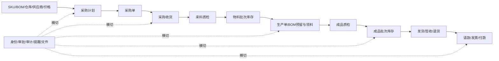
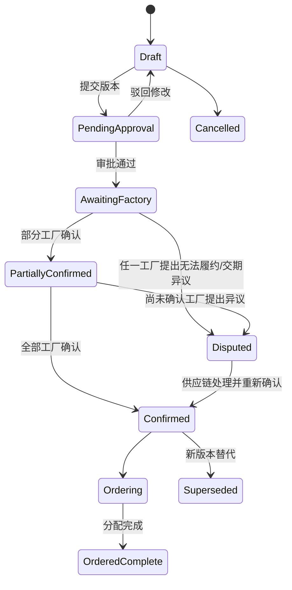
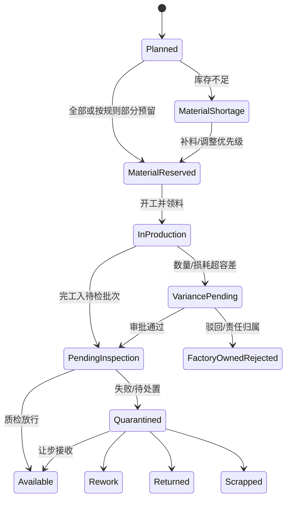

# 业务基线

## 1. 阅读说明

本文件回答三个问题：这个系统在管什么业务、当前到底做到了什么、重构后需要用什么场景证明没有改坏业务。

标记约定：

- **事实**：可由当前仓库代码/Schema/部署文件直接证明。
- **推断**：从代码和页面组合得出的高概率业务含义，仍需业务方确认。
- **建议**：为形成闭环而提出的目标规则，不代表现行业务已经批准。

成熟度不是代码量：

| 等级 | 含义 |
| --- | --- |
| 真实 | 页面和 API 已连接真实持久化，主要正常路径存在；仍需 UAT 才能上线 |
| 部分 | 有真实读写或规则，但状态、异常、权限或上下游没有闭环 |
| 演示 | 主要是静态数组、toast、Schema 骨架或未接入页面 |
| 断链 | 位于主链上，当前实现不能把业务事实可靠传给下一环节 |

## 2. 系统目的与业务边界

### 2.1 系统要解决的问题

**推断（高置信度）**：这是一个面向供应链公司、组装工厂、二/三级供应商、质检、收货方和财务人员的供应链协同系统。它希望把“计划、采购、生产、质量、库存、物流和结算”放到同一个可审计流程中，避免依赖分散 Excel、聊天和人工台账。

核心价值不是单纯做订单页面，而是让以下事实能够互相对账：

```text
为什么采购
  → 向谁、按什么价格采购
  → 哪个工厂按哪个 BOM 生产
  → 实际用了多少料、产了多少
  → 哪批货经过什么质检
  → 哪些数量可用/隔离/次品
  → 从哪些批次发给谁
  → 收到多少、退回多少
  → 应付多少、拿到什么票、实际付了多少
```

### 2.2 主链



### 2.3 当前实现边界与待批准目标范围

- **仓库事实**：业务对象是成品、辅料和配件；项目状态文档写明当前不继续管理这些配件更上游的原材料（`PROJECT_STATUS.md:156-179`）。
- **仓库事实**：当前生产代码没有工序、设备、工时、人员排班或完整制造成本模型；这说明现有实现不是完整 MES，但不能证明未来需求已排除 MES 深度。
- **仓库事实**：当前财务代码记录账期、请款、发票核验、付款和银行流水号，没有总账、税务申报或银行支付指令集成。
- **仓库事实**：当前物流代码登记承运商、物流单号、发货/签收凭证，没有承运商轨迹订阅或运费结算集成。
- **仓库事实**：采购需求主要被建模为外部文件导入，项目文档指向领星来源；当前没有销售订单、电商订单或预测领域。
- **建议（待 D-00 批准）**：首期生产范围聚焦一家试点组装工厂、少量 SKU 和完整采购到付款闭环；AI、全面绩效、预测性风险及外部物流/银行直连后置。

### 2.4 当前不应暗中假定的边界

以下事实尚未由业务确认：

- 工厂是否同时是一层供应商及结算主体。
- 领星/ERP/Excel 与本系统分别拥有哪些权威数据。
- 收货方是客户、平台仓、公司仓还是多种类型。
- 是否支持多法人、多币种、跨境税务或只支持人民币/中国发票。
- AI 助手是否属于首期真实生产范围。

这些问题集中在 `05-open-decisions.md`。

## 3. 组织、角色与数据范围

### 3.1 组织模型

**事实**：

- `factories` 表表示组装工厂（`db/schema.ts:9-16`）。
- `suppliers` 有 tier 和 `managedByFactoryId`，表达二/三级供应商归属工厂（`db/schema.ts:17-43`）。
- 用户可绑定 `factoryId` 或 `supplierId`（`db/schema.ts:68-79`）。
- 收货方没有独立主数据；当前发货可见性按 `organizationName` 与 `destination` 文本比较（`app/api/shipments/route.ts:68-77,395-413`）。

**风险**：Factory、Tier-1 Supplier、Legal Entity、Receiver 之间没有统一 Party 模型。重构前必须先确认现实组织关系，不能仅按现有表名搬迁。

### 3.2 角色矩阵

| 角色 | 预期职责（推断） | 当前数据范围/能力 | 当前主要缺陷 | 置信度 |
| --- | --- | --- | --- | --- |
| `admin` | 用户、角色、系统、全局救援 | 多数 API 视为内部全局角色 | 不在 `users.role` 基础枚举中；Header 冒充会放大为全局权限 | 高 |
| `supply_chain` | 主数据、采购、库存、物流、审批 | 广泛访问公司内部数据 | 权限过于粗；审批工作流角色没有完全细分 | 高 |
| `supply_chain_lead` | 高风险供应链负责人 | 财务风险解除代码引用 | 正常用户管理无法分配，属于漂移角色 | 高 |
| `finance` | 发票、请款、付款、财务审批 | 可读写财务，也能看部分广泛审批 | Step-up 可伪造；部分审批范围过宽 | 高 |
| `company_qc` | 公司级质检 | 被 `isInternal` 视为内部，可看全公司质检 | 需要确认是否也可查看完整 BOM/供应商信息 | 中高 |
| `factory` | 本工厂计划、订单、生产、库存、发货 | 多处按 `factoryId` 过滤 | 采购单包含任一工厂明细时可能返回整单全部明细；生产候选/创建也有越界风险 | 高 |
| `supplier_qc` | 本供应商或受托工厂的来料/成品质检 | 质检列表条件中该角色可见范围过宽 | `app/api/quality-inspections/route.ts:31-42` 可能让其看到全部记录 | 高 |
| `receiver` | 查看并确认发给本收货方的批次 | 按组织名称与目的地文本匹配 | 名称可变、非主键；账号与多个收货点关系不可表达 | 高 |

**事实**：基础角色枚举只包含 `supply_chain/finance/factory/supplier_qc/company_qc`（`db/schema.ts:73`），但 API/前端还使用 `admin/receiver`，并通过 `userRoles` 支持附加角色（`db/schema.ts:872-883`）。这是双轨角色模型。

**建议**：目标权限模型使用 `permission + scoped role assignment`。权限必须在后端 Query/Command 中按 factory、supplier、warehouse、receiver scope 强制，前端菜单只做用户体验呈现。

## 4. 功能成熟度地图

| 领域 | 当前能力 | 成熟度 | 关键证据 | 业务判断 |
| --- | --- | --- | --- | --- |
| 登录/会话/可信设备 | 密码、锁定、短信、Session、可信设备 | 部分 | `app/api/auth/*`、`app/lib/sessions.ts` | 正常机制较完整，但身份 Header 可绕过全部控制，暂不可生产 |
| 用户/角色 | 用户管理、附加角色、有效期、解锁 | 部分 | `app/api/users/route.ts`、`db/schema.ts:68-79,872-883` | 角色定义漂移，缺完整作用域与矩阵测试 |
| SKU/单位/BOM | 创建、版本、生效期、审批 | 部分真实 | `app/api/master-data/route.ts`、`db/schema.ts:206-260` | 可作为主数据基础；更新/停用/正式导入和历史快照需验收 |
| 仓库 | 创建、停用/合并审批、库存关联 | 部分真实 | `app/api/warehouses/route.ts` | 有基础，但跨仓范围和合并后历史需 UAT |
| 供应商与三级关系 | 档案、供应商-SKU、价格、产能、审批 | 部分真实 | `app/api/suppliers/route.ts`、`supplier-skus`、`supplier-prices` | 联系人/银行、产能例外、工厂/一层供应商关系未闭环 |
| Excel 导入 | 五类预览、暂存、差异 | **断链** | `app/api/imports/preview/route.ts:4,23-71`；`commit/route.ts:23-25` | 正式提交只实现供应商；采购/SKU/期初库存不能依赖当前流程 |
| 采购计划 | 版本、BOM 校验、工厂响应、容差 | 部分真实 | `app/api/purchase-plans/route.ts` | 多工厂共用整单状态，任一工厂可能过早确认/争议整单 |
| 采购单 | 计划分配、数量容差、工厂确认 | 部分真实 | `app/api/purchase-orders/route.ts` | 创建未完整接入 UI；客户端传供应商/价格，未锁审批价格 |
| 辅料/配件收货与来料入库 | 有来料质检概念和库存表 | **断链/缺失** | 质检 Schema 与库存 Schema 分离 | 缺清晰 Purchase Receipt、待检批次和采购到货对账 |
| 生产/BOM 执行 | 生产单、开工、物料数量、完工偏差 | 部分真实 | `app/api/production-orders/route.ts` | “预留/领料”未连真实库存；完工后进入待检但下游断开 |
| 质检 | 规则、抽检/全检、结果与缺陷字段 | **API 部分 + 页面演示 + 断链** | `app/api/quality-inspections/route.ts`；`app/page.tsx:257-285` | 结果未释放/隔离具体库存批次；不合格处置表大多未使用 |
| 批次库存/预留 | 状态数量、部分预留、FEFO、负数保护思路 | 部分真实 | `app/api/inventory/route.ts`、`db/schema.ts:676-709` | 预留缺释放/消费闭环；效期状态不会自动刷新 |
| 调拨 | 申请、审批、发出、收货 | 部分真实/高风险 | `app/api/inventory/transfers/route.ts` | 并发可重复发出/收货或负库存 |
| 盘点 | 冻结、盲盘、复盘、差异审批 | 接近真实但未验收 | `app/api/stocktakes/route.ts` | 仍需真实 MySQL 并发、恢复和账实 UAT |
| 发货 | 计划、工厂确认、凭证、FEFO 扣库、偏差审批 | 部分真实 | `app/api/shipments/route.ts` | 并发重试可能重复扣库/请款；物流、库存、财务强耦合 |
| 签收/物流异常 | 收货方确认、少货/破损异常 | API 部分 | `app/api/shipments/route.ts:395-476` | 收货方文本授权不可靠；现有页面组合可能被退货权限打断 |
| 退货 | 冻结、检验、处置审批、部分回库 | 部分真实 | `app/api/returns/route.ts` | 返工/报废/供应商责任和财务后果未完整闭环 |
| 请款/发票/付款 | 发货派生请款、双核、占票、部分付款、异常/冲正 | 部分真实/高风险 | `app/api/shipments/route.ts:479-577`；`app/api/finance/route.ts` | Step-up 可伪造，并发可超付；法律主体关系待确认 |
| 审批 | 多工作流、双人分离、高风险标记 | 部分真实/高风险 | `app/api/approvals/route.ts` | 跨约 27 表直接写；权限与事务不完整，可能“审批成功但业务失败” |
| 通知/提醒/邮件 | 后端表、提醒生成、HTTP job | API-only/部分 | `app/lib/reminders.ts`、`app/api/jobs/email/route.ts` | 前端通知图标未完整接入；任务无可靠 claim/retry，可能重发/漏发 |
| 审计 | 操作记录、敏感查看、归档时间、水印导出 | 部分真实 | `app/lib/audit.ts`、`app/api/audit-logs/route.ts` | 与业务写入多数不原子；不可变归档/恢复未证明 |
| 供应商绩效/风险 | 评价、权重、部分交付指标 | 部分/演示 | `app/api/supplier-performance/route.ts`、`supplyRiskCases` | 多个风险/核心供应商表无业务使用，不能按完整能力验收 |
| 工厂协同/AI 助手 | 页面和 Schema 骨架 | 演示 | `app/page.tsx`；`db/schema.ts:1012-1041` | 不应进入首期生产完成范围，除非业务明确要求 |

## 5. 当前主链逐步说明

### 5.1 主数据与计划输入

1. 供应链维护工厂、仓库、SKU、单位换算、BOM、供应商、供货关系和价格。
2. 数据可通过页面创建，部分对象需要审批。
3. Excel 能在浏览器/API 中预览，但除供应商外不能完整提交。

**断点**：若真实业务依赖 Excel 导入采购计划/采购单/期初库存，目前无法形成权威入库批次和交易基线。

### 5.2 采购计划

当前 Schema 已定义：

```text
draft → pending_approval → awaiting_factory_confirmation
      → confirmed / disputed → ordering → ordered_complete
      → superseded
```

**事实**：计划明细带 `factoryId`，工厂可提交 confirmed/unable 响应；代码随后直接把整单更新为 `confirmed` 或 `disputed`（`app/api/purchase-plans/route.ts:92-123`）。

**风险**：多工厂计划需要工厂级状态和整单聚合，否则第一家工厂的响应可能错误代表全部工厂。

### 5.3 采购单

供应链从计划明细创建采购单并分配数量；工厂确认或提出交期异议。采购计划据已分配量进入 `ordering/ordered_complete`。

**事实**：创建接口接受客户端 `supplierId` 和 `unitPriceTaxIncludedMinor`（`app/api/purchase-orders/route.ts:45-74`），未强制查询生效中的已审批价格。

**建议不变量**：

- 采购明细必须引用有效计划分配，累计数量不超过容差。
- 供应商必须在该工厂/SKU 的有效供货关系中。
- 价格、税率、币种、BOM 和容差在下单时形成不可变快照。
- 多工厂确认按工厂子单处理，整单状态由聚合规则计算。

### 5.4 到货、生产与领料

当前可以创建生产单、开工、记录物料发出/消耗/损耗并完工；生产偏差可能进入审批。

**事实**：创建生产单时只把 BOM 理论数量写入 `productionMaterialLines.reservedQuantity`，没有创建真实 `inventoryReservations`（`app/api/production-orders/route.ts:84-89`）。

**断点**：系统无法证明“这个生产单锁了哪些批次、后来实际领了哪些批次、释放了多少、是否与仓库余额一致”。辅料/配件的采购收货也没有清晰闭环。

### 5.5 完工与质检

**事实**：生产完工将公司所有权数量写入库存批次的 `pendingInspectionQuantity`（`app/lib/production-finalization.ts:53-75`）。

**事实**：质检 API 保存规则、抽样数据、合格/不合格数量和结果，但只引用生产执行单，没有 `inventoryBatchId`，也不更新该待检库存（`db/schema.ts:793-819`；`app/api/quality-inspections/route.ts:173-207`）。

**断点**：可以出现“质检记录显示通过，但库存仍待检”或无法判断释放的是哪一批货。不合格改判/处置也未形成完整审批和数量去向。

### 5.6 库存、发货与签收

库存批次区分可用、锁定、次品、待检、隔离和所有权；发货按 FEFO 思路扣减可用库存，并生成库存流水和发货凭证。

**事实**：发货还在同一路由事务中生成付款计划/请款（`app/api/shipments/route.ts:479-577`）。

**风险**：并发重试可能重复扣减不同批次、重复生成凭证或请款；收货方按目的地文本授权。

### 5.7 请款、发票与付款

发货后按工厂付款条件生成计划和请款；财务登记发票，两人核验；发票可占用到请款并支持部分付款、红票/作废、补票、退款和更正。

**事实**：付款登记、付款/退款更正和解除风险只检查客户端布尔 `smsVerified`；付款金额又在事务外汇总后插入（`app/api/finance/route.ts:294-316,498-531`）。

**风险**：高风险证明可绕过，并发付款可超额，当前财务台账不能作为生产可信账本。

## 6. 目标业务状态机基线

以下是重构需要实现并由业务确认的语义基线，不是说当前代码已经全部实现。

### 6.1 采购计划/采购单



采购单至少区分：待工厂确认、部分确认、已确认、有异议、履约中、完成、取消。**工厂子单/明细状态是事实源，整单状态只允许派生**；异议解决后重新按全部子状态聚合。

### 6.2 生产、质检与库存



数量守恒必须贯穿每次状态变化，任何状态数量都不能为负。

### 6.3 发货、签收与退货

```text
待工厂确认 → 已计划 → 待偏差审批（如需要） → 已发货
  → 已签收 / 异常签收
  → 异常处理完成
  → 退货在途 → 隔离 → 质检 → 待处置审批
  → 回库 / 返工 / 退供应商 / 报废
```

发货完成只能发生一次；签收和退货不得让同一数量同时处于客户持有和库存可用。

### 6.4 发票与付款

```text
请款：待发票 → 已生成 → 提交财务 → 部分付款 → 已付
                                └→ 发票异常冻结 → 修复/补票/退款

发票：待接收 → 已接收 → 双核中 → 已验证 / 已拒绝 / 已作废

付款：登记 → 生效
        └→ 更正申请 → 他人审批 → 追加冲正/更正
```

财务历史只追加，不覆盖原记录；所有更正可追溯到原流水、理由、证明、发起人、审核人和 Step-up。

## 7. 跨领域业务不变量

1. 用户不能仅靠提供另一个组织 ID 访问或修改其数据。
2. 高风险证明只能由服务端签发，绑定用户、会话、动作、对象版本和规范化交易意图哈希（金额、币种、银行引用、交易对手等关键字段），并且一次性消费；关键字段变化必须重新验证。
3. 发起人与审核人必须分离；同一审批只能有一个最终决议和一次业务效果。
4. 主数据版本在交易时形成快照；未来修改不能改变历史订单、生产和结算。
5. 计划明细累计下单量不得突破批准容差，除非完成对应例外审批。
6. 采购单供应商、价格和税务信息必须来自有效、已审批关系或有审计的例外。
7. 生产预留、领用、消耗、损耗、退料和完工必须可追踪到生产单与库存批次。
8. 每个库存批次的可用、锁定、待检、隔离、次品数量均不为负，且状态转移总量守恒。
9. 质检结果必须绑定可处分批次；放行/隔离/处置总量等于被检数量。
10. FEFO 只从允许发货的公司所有权、非隔离、非过期冻结可用库存扣减。
11. 同一发货批次只能有一次有效扣库、发货凭证和请款派生。
12. 发票有效占用不得超过有效票额；付款净额不得超过请款可付额。
13. 财务和库存更正通过追加补偿，不物理覆盖原事实。
14. 所有交易、审批、敏感查看和导出都有与业务提交一致的审计关联。
15. 重试同一命令不会产生第二个业务结果；同幂等键不同请求内容必须拒绝。

## 8. 必须跑通的 UAT 场景

以下为签字级验收骨架。具体单号、金额、容差和数量使用业务方批准的 UAT 数据集。

| ID | 角色/前置 | 操作 | 预期结果 | 账实/审计校验 |
| --- | --- | --- | --- | --- |
| UAT-IAM-01 | 未登录；知道一个有效邮箱 | 从公网入口伪造身份 Header 调用敏感 API | 401，不建立会话 | 无业务/审计伪造主体写入；安全告警可追踪 |
| UAT-IAM-02 | 工厂 A 用户；存在工厂 B 单据/文件 | 替换 URL、Body、分页/导出中的组织 ID | 全部拒绝或按隐匿策略返回不存在 | 工厂 B 数据无读取/写入；授权拒绝有 requestId |
| UAT-MD-01 | 供应链；存在相邻日期 BOM/价格版本 | 在生效边界创建计划/订单，随后修改新版本 | 交易锁定当时有效版本 | 历史交易快照不随主数据修改变化 |
| UAT-IMP-01 | 供应链；合法与坏行混合 Excel | 预览、映射、确认，重复提交同一文件/命令 | 坏行可定位；成功批次只提交一次 | 批次状态、逐行结果、业务记录数和审计一致 |
| UAT-PROC-01 | 一个计划含工厂 A/B | A 确认、B 暂未响应/提出异议 | A 的状态不把整单误判为全部确认；异议可处理 | 工厂级响应与整单聚合可解释 |
| UAT-PROC-02 | 有已审批和未审批价格 | 创建采购单并尝试篡改供应商/价格 | 只接受有效供货关系和价格快照；篡改拒绝 | 订单金额、税率、版本与价格协议一致 |
| UAT-REC-01 | 已确认采购单；辅料/配件到货 | 登记收货、来料质检通过/失败并重复提交 | 收货引用采购明细；创建唯一待检批次；通过后放行，失败后隔离 | 收货量、质检量、待检/可用/隔离和采购累计到货守恒 |
| UAT-MFG-01 | 物料跨两个批次且只够部分预留 | 创建生产单、调整优先级、补料、领料、退料 | 缺口明确；预留/释放/消费按批次执行 | 库存状态和 movement 与生产物料行守恒 |
| UAT-MFG-02 | 完工数量/损耗超容差 | 提交完工，审批通过/驳回各跑一次 | 未批准前不产生可用成品；每个决定只生效一次 | 生产报告、审批、待检库存和审计原子一致 |
| UAT-QC-01 | 已有具体待检成品批次 | 质检全部通过并重复提交 | 对应数量一次性从待检转可用 | 待检减少=可用增加；质检记录关联批次 |
| UAT-QC-02 | 抽检失败且允许部分处置 | 转全检，拆分放行/返工/报废/退回 | 每个数量有唯一去向；让步接收需审批 | 放行+隔离/处置=批次数量，无负数/重复释放 |
| UAT-INV-01 | 两客户端/50 并发请求同一库存 | 同时预留、调拨发出或消费超过可用量 | 仅合法请求成功，其他返回冲突 | 库存不负、movement 不重复、余额可由流水重建 |
| UAT-SHP-01 | 两个有效库存批次，不同效期 | 发货并重复/并发提交同一命令 | 按 FEFO 一次扣库，一次生成凭证/请款 | 发货量=批次扣减=movement=请款来源数量 |
| UAT-SHP-02 | 正确收货方与其他收货方账号 | 确认正常签收、少货、破损，并尝试越权 | 仅目标收货方可操作；异常进入处理链 | 签收、异常、退货数量与发货量守恒 |
| UAT-RET-01 | 已签收批次发生部分退货 | 退货在途→隔离→检验→回库/返工/报废 | 退货数量不能超过可退；处置经权限/审批 | 客户持有、在途、隔离、可用/报废数量守恒 |
| UAT-FIN-01 | 一张发票、两位不同财务 | 登记、双核、占用到请款 | 发起人不能完成两次核验；票额不超占 | 发票、核验、占用、审计一一对应 |
| UAT-FIN-02 | 剩余可付金额固定 | 50 并发付款 + 重复银行流水 | 有效净付款不超额，流水不重复 | 请款余额、付款账本、银行引用和审计一致 |
| UAT-FIN-03 | 已完成一次 Step-up | 修改金额/币种/银行引用/对象版本，或对另一个付款/动作重放 proof、提交 `smsVerified:true` | 全部拒绝；原 proof 只允许对绑定交易意图消费一次 | canonical request hash、challenge/grant 消费记录与业务事务一致 |
| UAT-APR-01 | 两名审核人同时处理同一审批 | 一人批准、一人拒绝/重复批准 | 仅一个终态与一次业务副作用 | 审批、领域状态、审计和 Outbox 原子一致 |
| UAT-DR-01 | 隔离环境使用真实备份 | 恢复 RDS/OSS 并启动同版本应用 | 在目标 RPO/RTO 内恢复 | 登录、库存、发货、发票、付款、审计、附件抽样全通过 |

## 9. 异常链清单

生产上线不能只验 happy path，至少覆盖：

- 文件重复、坏行、未知 SKU/工厂/供应商、导入中断和重试。
- BOM 版本边界/重叠、价格过期、供应商停用、产能超限。
- 计划欠量/超量、多工厂部分确认、确认超时和交期争议。
- 物料不足、部分预留、优先级调整、生产少产/超产、损耗超限。
- 抽检失败、全检、部分放行、不合格拆分处置和质检改判。
- 并发预留、调拨重放、盘点冻结、效期转黄/红/过期。
- 发货日期偏离、重复发货、少货/破损签收、物流异常和退货。
- 发票驳回、红票/作废、部分补票、部分退款、付款更正和冲正。
- Session 吊销、角色过期、账号锁定、Step-up 过期/重放、跨组织 ID 枚举。
- 邮件/短信/OSS/数据库超时、Worker 重启、Outbox 重复消费和死信。

## 10. 术语表

| 术语 | 本文含义 | 待确认点 |
| --- | --- | --- |
| 组装工厂 Factory | 执行生产、持有工厂/仓库作用域的组织 | 是否也是一层供应商/结算主体 |
| 供应商 Supplier | 提供物料或产品的交易对手，当前支持 tier | 一层供应商与工厂关系 |
| 采购计划 | 对工厂、仓库、SKU、到货日期和数量的需求版本 | 多工厂整单/子单语义 |
| 采购单 | 向供应商下达的采购承诺及计划分配 | 法律主体、价格锁定、外部系统权威 |
| BOM 快照 | 交易/生产创建时固定的 BOM 版本及用量 | 重叠版本选择规则 |
| 生产单/执行单 | 工厂生产某成品和记录物料/完工的聚合 | 与采购明细是一对一还是可拆分 |
| 库存批次 | 具有来源、仓库、SKU、效期、所有权和状态数量的资产批次 | 部分质检是否拆子批次 |
| 预留 | 将可用库存分配给特定业务需求但尚未实际消耗 | 优先级、释放、超卖规则 |
| 待检 | 已入账但未获准使用/发货的库存状态 | 是否允许紧急让步使用 |
| 隔离 | 因质量、退货或异常不可自由使用的库存状态 | 谁能解除、是否需要高风险审批 |
| FEFO | 优先使用/发出最早到期的合格可用批次 | 无效期/估算效期的排序规则 |
| 请款 | 基于交付和付款条件形成的应付请求 | 与法人、工厂、采购单的关系 |
| 发票占用 | 将有效票额分配给一个或多个请款 | 跨法人/跨币种是否禁止 |
| Step-up | 高风险操作前的二次身份验证证明 | 哪些动作强制、有效期多长 |
| 审批效果 | 审批决议对所属业务聚合产生的状态/金额/库存变化 | 每个 workflow 的审核角色和处理器 |
| 冲正 | 以追加反向记录纠正财务/库存原事实 | 谁批准、如何关联原记录 |

## 11. 业务验收责任

建议明确四类签字人：

- 供应链 Owner：主数据、供应商、采购、生产/库存/物流规则。
- 质检 Owner：抽检、全检、放行和不合格处置。
- 财务 Owner：法人、发票、请款、付款、退款和冲正规则。
- 技术/运维 Owner：权限、安全、迁移、并发、监控和恢复证据。

QA 负责组织和保存证据，但不能代替业务 Owner 决定业务语义。
