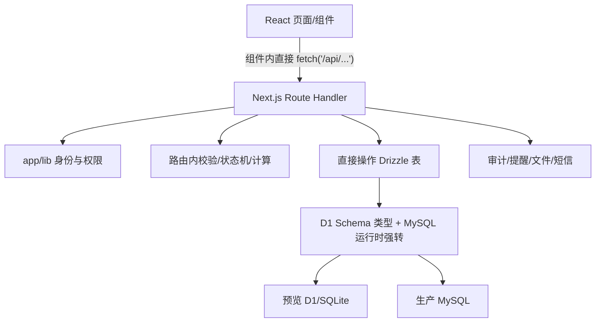
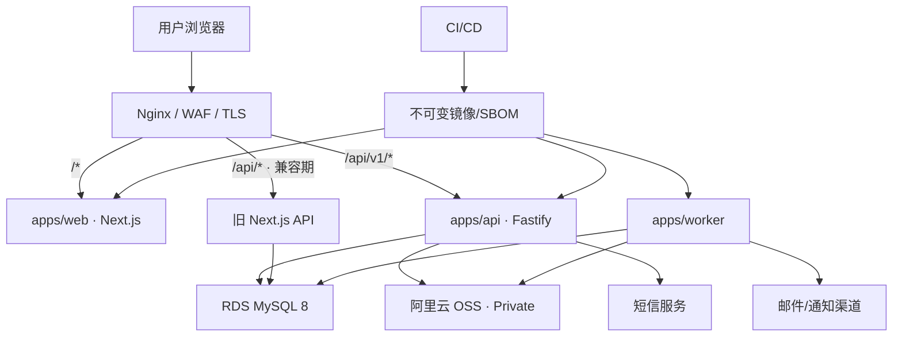
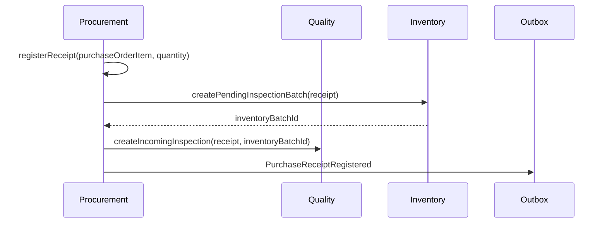
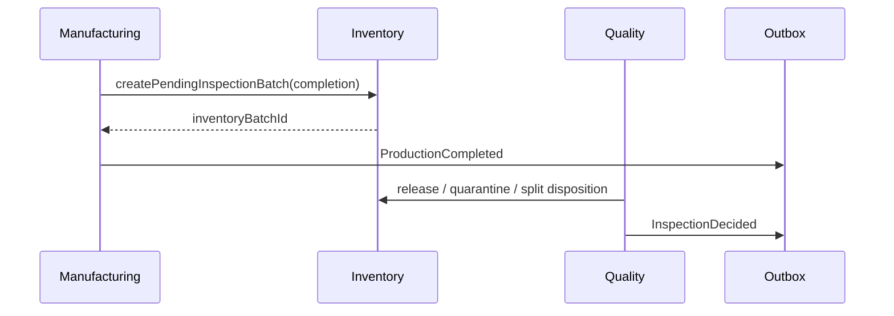

# 目标架构

## 1. 决策状态

| 标记 | 含义 |
| --- | --- |
| 已确认 | 用户已经批准，后续实现可按此展开 |
| 推荐默认 | 技术方案的默认落点；若业务事实没有推翻它则采用 |
| 待确认 | 会影响业务语义、外部兼容或生产指标，见 `05-open-decisions.md` |

### 已确认

- 目标是前后端分离并达到生产可用，而不是一次性重写所有功能。
- 后端采用 Fastify + TypeScript + Drizzle/MySQL 的模块化单体。
- Web、API、Worker 独立运行；Nginx 保持同域访问。
- 新接口使用 `/api/v1`，旧 Next.js `/api` 在迁移期保留。
- 采用逐模块 Strangler 迁移，不先拆微服务，不做无控制双写。

### 推荐默认

- 继续使用 pnpm workspace；先建立新目录和边界，再搬动现有前端目录，减少无意义的大规模 diff。
- MySQL 8 成为开发集成测试、UAT 和生产的唯一业务语义；D1 仅可作为明确隔离的演示适配器，最终移除。
- 浏览器身份继续使用服务端 Session Cookie；不在第一阶段改成前端持有长寿命 JWT。
- API Schema 与 OpenAPI 同源生成，前端只通过统一 Client 访问后端。
- 单库事务保证核心账实原子性，事务 Outbox 负责邮件、通知、投影等异步副作用。

## 2. 当前架构与问题



主要问题不是文件都在同一个仓库，而是依赖方向和事务所有权不清楚：

- HTTP 处理器同时解析输入、判断权限、执行状态机、写多张表、发提醒并拼 Response。
- `app/api/approvals/route.ts` 直接导入约 27 张跨领域表，审批模块实际上成为业务总控制器。
- 发货路由同时处理物流、FEFO 库存扣减和财务请款；生产与退货也直接写库存表。
- `db/index.ts:24-28` 将 MySQL Drizzle 实例强转为 D1 类型；生产方言错误不能在编译期暴露。
- 前端组件手写 URL 和 JSON，没有 API 版本、运行时 DTO、统一错误码或生成 Client。
- Web、API、后台任务共享一个发布单元，任何一类变化都要整体构建和回滚。

## 3. 目标运行拓扑



Nginx 在迁移期承担明确路由所有权：

| 路径 | 所有者 | 说明 |
| --- | --- | --- |
| `/*` | Web | 页面、静态资源、前端运行时配置 |
| `/api/v1/*` | Fastify API | 所有新接口与已迁移领域 |
| `/api/*` | Legacy Next API | 只兼容，不新增业务；按领域逐步缩减 |
| `/api/v1/health/live` | Fastify API | 可选经 Nginx 暴露的 API 存活探针 |
| `/api/v1/health/ready` | Fastify API | 可选经 Nginx 暴露的 API 就绪探针 |

Web/API 容器各自在内部端口提供 `/health/live` 与 `/health/ready`，由容器编排直接探测，不共用一个 Nginx 路径。Worker 默认无公网入口：通过内部管理端口或数据库 heartbeat + 进程探针检查，不把健康接口暴露给浏览器。

## 4. 推荐仓库结构

```text
apps/
  web/                       # 现有前端，迁移后不含 DB/服务端业务规则
  api/                       # Fastify HTTP/组合根，只装配模块公开入口
  worker/                    # Outbox、提醒、邮件、效期和文件任务
packages/
  contracts/                 # 请求/响应 Schema、OpenAPI、生成 Client
  database/                  # MySQL Schema、迁移、UnitOfWork、Outbox
  platform/                  # 配置、日志、OSS、短信、邮件、Telemetry
  modules/                   # API 与 Worker 复用的领域/application 实现
    iam/
    master-data/
    supplier-network/
    procurement/
    manufacturing/
    quality/
    inventory/
    logistics/
    finance/
    governance/
    documents-imports/
    performance-risk/
  test-support/              # MySQL fixtures、角色矩阵、契约测试工具
```

第一阶段不强制立即把当前 `app/` 整体移动到 `apps/web/`。先让新 API 可独立构建运行，再做前端目录迁移，可以降低路径改写噪音并保留清晰回滚点。

## 5. 模块内部结构与依赖规则

每个业务模块使用相同的四层，但不为了形式创建空目录：

```text
<module>/
  domain/          # 实体、值对象、状态转换、不变量；不依赖 HTTP/Drizzle
  application/     # 用例、命令、查询、端口、事务边界
  infrastructure/  # Drizzle Repository、外部服务适配器
  http/            # Fastify Route、Schema、DTO 映射
```

强制依赖方向：

```text
http ───────┐
            ▼
infrastructure → application → domain
                         ▲
platform/database ───────┘  （通过端口注入）
```

规则：

1. Domain 不导入 Fastify、React、Next.js、Drizzle 或云服务 SDK。
2. HTTP 层只做认证上下文、Schema 校验、DTO 映射和状态码映射。
3. 一个模块不得直接写另一个模块拥有的表；必须调用对方应用服务或处理领域事件。
4. 共享内核只保留 `ActorContext`、ID、Money、Quantity/Unit、业务时间、领域错误和事务/事件接口。
5. 各模块自己的状态枚举、DTO 和表结构不能塞进庞大 `shared` 包。
6. 查询可通过专用 Read Model 组合数据，但写命令必须由拥有该聚合的模块处理。
7. API 与 Worker 都只能调用 `packages/modules/*` 的公开 application port；Worker 不复制领域规则、不直接写业务表，也不反向导入 `apps/api`。

## 6. 领域所有权

| 模块 | 拥有的业务职责 | 不能直接拥有的职责 |
| --- | --- | --- |
| IAM | 用户、凭证、会话、可信设备、Step-up、角色、组织作用域 | 采购/库存/财务业务状态 |
| Master Data | 工厂、仓库、SKU、单位换算、BOM 版本 | 供应商价格、生产执行 |
| Supplier Network | 二/三级供应商、供应商-SKU、产能、价格协议 | 采购单状态、付款 |
| Procurement | 采购计划、工厂响应、采购单、计划分配、价格/BOM 快照、采购收货（Purchase Receipt） | 实际库存扣减、付款 |
| Manufacturing | 生产单、BOM 快照、领料申请、消耗/损耗、完工报告 | 直接改库存余额、质检判定 |
| Quality | 质检规则、质检任务、缺陷、全检、不合格处置 | 直接绕过库存状态机 |
| Inventory | 批次、状态数量、预留、流水、FEFO、调拨、盘点 | 采购/财务审批语义 |
| Logistics | 发货计划、发货批次、凭证、签收、物流异常、退货流程 | 直接操作财务表或库存表 |
| Finance | 付款条件、请款、发票、双核、占用、付款、退款、冲正 | 发货和库存状态 |
| Governance | 审批生命周期、职责分离、审计、提醒、通知 | 所有领域的业务副作用实现 |
| Documents/Imports | 上传会话、扫描、解析、暂存、映射、逐行结果 | 绕过领域服务直接提交采购/库存/财务事实 |
| Performance/Risk | 供应商指标、季度评价、风险案例、查询投影 | 修改订单/库存/财务原始记录 |

### 审批的特殊边界

审批模块只拥有审批单、审核策略、职责分离、高风险证明和决策生命周期。各领域注册自己的 `ApprovalEffectHandler`：

```text
ApprovalWorkflow.decide()
  ├─ 校验 reviewer policy / separation of duty / step-up
  ├─ 原子抢占 pending 审批
  └─ 调用领域 ApprovalEffectHandler
       ├─ ProcurementApprovalHandler
       ├─ InventoryApprovalHandler
       ├─ ManufacturingApprovalHandler
       └─ FinanceApprovalHandler
```

审批状态、领域副作用、审计 Outbox 必须在同一数据库事务内提交；处理器失败时审批不能显示成功。

### 跨模块核心流程

模块化单体允许在同一进程和同一数据库事务中同步编排关键账实流程：

采购物料进入系统的权威入口是 Procurement 拥有的 Purchase Receipt。收货确认本身、来料质检任务和待检库存批次由应用编排器在同一 Unit of Work 内调用各模块公开端口：



库存批次释放仍由 Quality 决策后调用 Inventory，不由 Procurement 直接改余额。



生产、质检、库存可以是独立模块，但其迁移和 UAT 必须作为同一业务波次完成。

## 7. API v1 契约

### 7.1 契约事实源

- 每个 Route 使用运行时 JSON Schema 校验参数、Body 和响应。
- Schema 生成 OpenAPI，并生成前端 TypeScript Client；禁止手工复制 DTO。
- API 只返回公开 DTO，不暴露 Drizzle Row、内部错误或数据库字段偶然结构。
- 日期时间统一为带时区 ISO 8601；业务日期使用 `YYYY-MM-DD`；金额使用最小货币单位整数；数量明确单位和精度。
- 对外 ID 按 opaque string 处理，避免 MySQL BIGINT 与 JavaScript 安全整数范围耦合。
- 列表统一使用有界的 cursor 分页、排序和过滤约定；禁止无界全表返回；敏感导出使用异步任务和一次性下载凭证。

### 7.2 URL 与命令

- 资源查询使用稳定名词，例如 `/api/v1/purchase-orders/{id}`。
- 业务动作使用显式命令子资源，例如 `/api/v1/purchase-orders/{id}/confirmations`，不再用一个 Route 的 `action` 字段承载十余种不相关操作。
- 所有创建/状态转换命令接受 `Idempotency-Key`；服务端保存操作者、与 URL 无关的 canonical command type/aggregate、规范化请求摘要和结果。旧 `/api` 与新 `/api/v1` 对同一业务意图必须命中同一幂等作用域。
- 需要防止丢失更新的资源使用 `version` 或 `If-Match`；状态转换 SQL 必须限定预期旧状态。

### 7.3 统一错误

推荐响应结构：

```json
{
  "code": "INVENTORY_INSUFFICIENT",
  "message": "可用库存不足",
  "details": [{ "field": "quantity", "reason": "requested_exceeds_available" }],
  "requestId": "req_..."
}
```

- `400/422`：格式或字段校验失败。
- `401`：未认证；`403`：身份有效但无权限或超出数据范围。
- `404`：在当前作用域内不存在；避免通过 ID 猜测泄露外部组织数据。
- `409`：状态冲突、版本冲突、幂等键请求不一致或业务不变量冲突。
- `428`：需要额外 Step-up 证明时可使用，但错误码必须稳定。
- `500`：只返回通用消息和 `requestId`，内部错误进入日志和追踪。

## 8. 身份、授权与浏览器安全

### 8.1 Session

- 保留服务端随机 Session Token + HttpOnly Cookie；数据库只存哈希。
- 登录、登出、会话吊销和密码变更由 IAM 模块统一处理。
- Cookie 名、Path 和过渡期兼容策略必须支持旧、新 API 同时读取同一会话。
- Nginx 显式清除 `oai-authenticated-user-email` 及所有身份断言头；阿里云模式禁止 Header fallback。
- 本地预览若保留自动身份，只能由显式 `APP_ENV=local_preview` 开关启用，并绑定回环地址。

### 8.2 授权

授权采用 RBAC + 数据作用域：

```text
是否允许 = 角色允许该动作
        AND 用户当前角色仍有效
        AND 业务对象属于 actor 的 factory/supplier/receiver scope
        AND 满足职责分离与状态机约束
```

作用域必须在 Repository/Query Policy 层注入，不能依赖前端传入 `factoryId` 后再比较。外部角色的不存在与越权对象均返回同样的 404/403 策略，防止枚举。

### 8.3 Step-up

高风险证明必须绑定：`userId + sessionId + action + entityId + entityVersion + canonicalRequestHash + expiresAt + nonce`。`canonicalRequestHash` 覆盖金额、币种、银行引用、交易对手、日期等会改变风险的字段；任一关键字段变化都要求重新 Step-up。业务事务原子消费一次性证明；接口不再接受 `smsVerified: true`，也不允许证明跨动作/对象复用。

### 8.4 CSRF/CORS

- 同域方案默认不开放通配 CORS。
- 所有状态变更请求校验 `Origin`/`Sec-Fetch-Site`，并使用 CSRF Token 或等价双重防护。
- 若未来选择跨站域名，必须单独评审允许源、Cookie Domain/SameSite、`credentials`、预检缓存、Token 刷新与登出传播；不能简单设置 `Access-Control-Allow-Origin: *`。

## 9. 数据、事务与并发

### 9.1 MySQL 唯一事实源

- 维护显式 MySQL Schema，不再通过正则把 SQLite Schema 变成生产 Schema。
- 本地集成测试使用临时 MySQL 8 实例；SQLite/D1 不能替代核心写路径测试。
- 数据库访问统一使用真实 MySQL Drizzle 类型，禁止 `as unknown as PreviewDb` 一类跨方言强转。
- 生产 Schema、迁移文件和迁移历史先盘点对齐，再允许自动迁移。
- 当前 SQLite 迁移日志有 10 个版本，而 MySQL 迁移日志只有 2 个；虽然两个 Schema 文件现有表数都为 84，这仍不能证明迁移历史和线上结构一致（`drizzle/meta/_journal.json`、`drizzle-mysql/meta/_journal.json`）。
- 当前预览事务适配会跳过真实 MySQL 事务语义（`db/transaction.ts:7-20`），因此预览成功不能作为生产并发/原子性证据。

### 9.2 事务规则

- 一个命令的状态改变、库存/金额变更、幂等记录和 Outbox 事件在同一事务提交。
- 高竞争聚合使用 `SELECT ... FOR UPDATE`、带版本/旧状态条件的原子更新或可证明等价的约束。
- 余额、库存不得采用“事务外汇总后直接插入”的 check-then-act 模式。
- 财务更正采用追加冲正/更正，禁止覆盖原流水；库存调整保留不可变流水并可对账到余额。
- 关键唯一性由数据库约束兜底：发货批次→付款计划、银行流水、入库来源、幂等键等。

### 9.3 Outbox

同一事务写入 `outbox_events`；Worker 使用租约原子 claim：

```text
pending → processing → delivered
                   └→ retry_wait → processing
                   └→ dead_letter
```

每个消费者以 `eventId + handler` 去重，使用指数退避、最大次数、死信告警和人工重放审计。邮件、站内消息、绩效投影、搜索索引等可异步；库存和付款等核心事实不依赖“最终可能成功”的异步消息才能成立。

### 9.4 跨版本写入围栏

Nginx 和前端开关只能决定流量方向，不能证明唯一写入者。新旧写处理器必须共同校验数据库中的用例级 `writer_fence`：

```text
commandType | owner(legacy/v1/blocked) | epoch | activatedAt | changedBy
```

切写协议：

1. 将目标用例置为 `blocked`，新旧处理器都拒绝新命令。
2. 等待旧实例在途请求排空，并按 canonical command identity 对账。
3. 原子递增 epoch，把 owner 改为 `v1`；新写事务必须携带并校验当前 epoch。
4. Nginx/前端再切流；旧入口在 owner 不匹配时稳定返回 409/410，不得继续写入。
5. 切换后持续探测旧入口拒写、幂等命中和账实差异。

Writer fence、幂等记录和业务唯一约束共同防止“v0 已提交但响应丢失，v1 又重试”的跨版本重复效果。

## 10. 文件与导入

- 上传先创建 Upload Session，限制大小、扩展名和业务类别。
- 服务端校验文件魔数，恶意文件扫描后从隔离区转为可用；对象和数据库元数据具有可恢复的完成状态。
- Excel 解析进入资源受限 Worker，限制 Sheet、行列、字符串长度、公式和处理时长。
- 导入采用 `upload → preview → stage → map → validate → confirm → commit`，指纹和业务键共同防重复。
- Documents/Imports 只拥有上传、解析、暂存和映射；`commit` 必须调用对应领域 application port，并服从该领域 writer fence，不能直接写采购或库存表。
- 提交必须给出逐行结果、批次审计和可重试语义；正式数据失败时不能留下“批次已提交但只写一半”。

## 11. 可观测性与运行配置

- 每个请求生成/透传 `requestId` 和 trace context；日志为结构化 JSON，自动脱敏手机号、Cookie、验证码、银行信息和文件签名 URL。
- 指标至少覆盖请求量/延迟/错误、数据库池、事务冲突、Outbox 积压、任务失败、短信/邮件、导入耗时、登录锁定和授权拒绝。
- Trace 跨 API、数据库和 Worker；关键业务日志携带 actor、scope、entity、command、idempotencyKey。
- 配置在启动时做 Schema 校验；密钥仅来自受控环境/密钥服务，不通过前端构建变量泄露。
- liveness 不访问外部依赖；readiness 检查数据库连通、Schema 兼容和必要配置，但设置短超时。

## 12. 构建、发布与回滚

- Web/API/Worker 分别产生不可变镜像，标记 Git SHA、依赖锁文件摘要、迁移版本和 SBOM。
- CI 先验证后构建；生产服务器只拉取已验证镜像，不临时从源码构建。
- 数据库采用 Expand → Migrate/Backfill → Switch → Contract；破坏性 Contract 只能在旧版本下线且恢复窗口结束后执行。
- API 切换使用 writer fence 作为写所有权事实源，Nginx/Feature Flag 只做流量控制；GET 只有在明确无副作用的 shadow context 或离线只读副本中比较。
- **首次 v1 写入前**：可以阻断写入、排空、对账后把 owner 回切 legacy。
- **首次 v1 写入后**：除非 legacy 已通过新 Schema/语义兼容证明，否则不能把它重新设为 writer；应先冻结该领域写入，部署最后兼容的 v1 版本或向前修复。
- 财务/库存事实由当前领域版本提供的版本化 compensating command 修正；补偿需要权限、审批/Step-up、幂等、原记录引用和审计，不能靠数据库快照覆盖或临时 SQL 冒充回滚。

## 13. 架构决策记录（ADR）候选

| ADR | 状态 | 决策摘要 |
| --- | --- | --- |
| ADR-001 | 已确认 | Fastify 模块化单体，不以微服务作为第一目标 |
| ADR-002 | 已确认 | 同域 Nginx + `/api/v1` Strangler 迁移 |
| ADR-003 | 推荐默认 | MySQL 8 为唯一业务语义，移除 D1→MySQL 类型伪装 |
| ADR-004 | 推荐默认 | Session Cookie 保持，暂不改长寿命 JWT |
| ADR-005 | 推荐默认 | JSON Schema/OpenAPI/生成 Client 为契约事实源 |
| ADR-006 | 推荐默认 | 单库事务 + Transactional Outbox |
| ADR-007 | 推荐默认 | 领域拥有写模型，审批通过领域 Handler 执行副作用 |
| ADR-008 | 待确认 | 收货方、工厂/一层供应商、领星等外部系统的权威主数据模型 |
| ADR-009 | 推荐默认 | 数据库 writer fence + canonical command identity 保证跨版本单一写入者 |
| ADR-010 | 推荐默认 | Purchase Receipt 归 Procurement，跨 Quality/Inventory 同事务编排 |

## 14. 明确不做的事

- 不把现有 Route Handler 原样复制进 Fastify。
- 不先拆微服务、消息总线和多数据库。
- 不在没有契约和 UAT 的情况下大爆炸切换全部 API。
- 不让 Web 直接连接数据库或持有云服务密钥。
- 不用前端按钮禁用代替后端授权。
- 不把“最终一致”用于掩盖库存、付款和审批的原子性要求。
