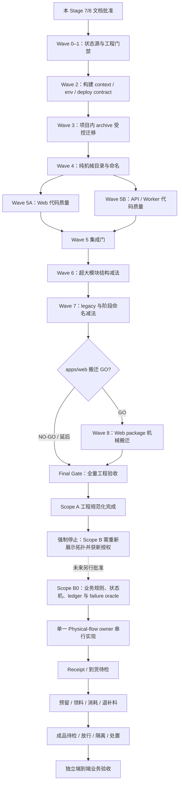

# Stage 8 工程规范化实施编排计划

> 状态：**待用户最终批准；尚未派发实施任务**
> 结果依据：[`stage7-engineering-normalization-debt.md`](./stage7-engineering-normalization-debt.md)
> 当前产品边界：Scope A 已完成前后端运行分离与基础安全收口；本计划只做工程规范化，不实施 Scope B 业务补全。

## 1. 目标与完成定义

### 1.1 总目标

在不改变现有业务语义、公开 API、持久化事实和生产安全不变量的前提下，把当前仓库收敛为：

1. Web、API、Worker 三个独立运行应用；
2. contracts、database、infrastructure、tooling、tests、docs、archive 各有单一所有权；
3. 根目录原则上只保留仓库入口和跨包配置；若可选 T4 NO-GO/跳过，则根 `app/` 与受宿主根路径约束的 Web 配置作为经批准例外保留，并明确 owner，不据此否定 Scope A；
4. 工具链、构建、测试、迁移、发布和回滚可以在 clean environment 重复执行；
5. 历史/未知有价值资产在项目内 `archive/` 受控保留，不靠删除美化目录；
6. 真实代码质量和超大模块复杂度下降，但不引入空 DDD、CQRS、event-sourcing、微服务或新平台。

### 1.2 Scope A 工程规范化完成定义

- Stage 7 的 23 项债务均被关闭、降级为有证据的后续项，或由用户明确接受。
- 目录所有权与 Stage 7 第 6 节一致；条件目录未被无依据创建。
- 生产源码总量和最大文件规模有可解释下降，结构指标优先于机械 LOC 目标。
- lint 只扫描源码，errors 为 0；warnings 为 0 或有逐项批准、自动冻结的基线。
- Web/API/Worker/Contracts 四套 TypeScript、全部测试、真实 MySQL、三镜像、Compose/Nginx、deploy/rollback 门禁可重复。
- migration history、writer identity/fence、Step-up digest、idempotency 和 audit/outbox 协议未因规整漂移。
- archive manifest 覆盖所有已迁移历史资产，移动前后 hash/bytes/恢复证据成立，未销毁唯一副本。
- 没有实现 PurchaseReceipt、BOM 实际库存预留/消耗、质检库存放行/隔离等 Scope B。

## 2. 当前基线与前置事实

- 远端默认分支：`main`；正式实施必须从当时已验收、已集成的准确 SHA 创建，不从文档分支或未知工作树猜测。
- 当前文档分支：`agent/engineering-normalization-debt`；其 Draft PR 只承载 Stage 7/8 文档，不是实施基线。
- Stage 6 安全验收结论为 GO；它保存现有真实 MySQL、Docker runtime、权限、迁移与发布证据。
- Stage 7 已完成 80/80 根目录台账、29 个 tar 的逐项事实和工程债务清单。
- 正式派发前必须重新确认主工作树 clean、远端 main SHA、依赖安装状态、Docker/MySQL 资源与当前权限档案。

## 3. 不可弱化的安全与兼容不变量

任何 Wave 若要改变以下语义，立即停止并返回主任务裁决；不能以“目录规整”“抽公共层”或“降低 LOC”为理由继续：

- session、RBAC、data scope、scope-before-LIMIT、production fail-closed；
- CSRF、Origin、同域 Cookie、request-id、no-store 与安全日志脱敏；Cookie 协议冻结为 `topology_session`（`Path=/; HttpOnly; Secure; SameSite=Strict`）和 `topology_csrf`（`Path=/; Secure; SameSite=Strict`，故意非 HttpOnly 以支持 double-submit），清除响应保持同名/同 Path/同安全属性；
- Step-up 对 session、action、权威对象、毫秒版本和 canonical digest 的绑定及事务内消费；
- MySQL transaction/lock/CAS、wall-clock deadline、幂等与 unknown-outcome fail closed；
- writer fence/resource identity/generation、事务内 audit/outbox；
- 文件 entity scope、quarantine/scan、provider 最小权限；
- migration append-only、history hash/preflight、fresh/upgrade oracle；
- deploy 默认不隐式改变 writer owner；generation-2 facts 后禁止不兼容 legacy rollback；
- Web/API/Worker 的 non-root、read-only、`no-new-privileges`、`cap_drop=ALL`、有界 health；
- 旧业务 GET/写退役边界和 v1 单一业务实现。

目录移动和模块拆分还必须冻结以下可枚举事实：API 注册 manifest 与已知端点、release manifest 中 generation=2 的 command/resource 清单、outbox topic/dedup identity、approval workflow/effect type、file entity type、audit action/module/entity，以及 18 个 legacy GET 的精确 `410 + WRITER_MOVED + successor Link`。API readiness 不能替代“业务模块确实已注册”的断言。

写命令顺序保持：Origin/CSRF → session/RBAC/scope → writer fence → idempotency → transaction/lock/CAS → Step-up 消费 → 业务写 → audit/outbox → commit。模块抽取不得复制、绕开或重排统一 command/approval 核心；scope 必须继续在 SQL `LIMIT` 前生效。

Worker readiness 与执行 fence 是不同语义：generation/owner identity 正确且 `enabled=0` 时可以健康待命，但 claim/provider 副作用必须停止且不消耗 attempt。任何 Wave 均不得把二者合并为同一 enabled 判断。

## 4. 编排范式与控制所有权

### 4.1 当前规划结果

本次文档采用**单一结果所有者**：主任务是唯一写者，内部 Agent 只读质询。两份正式产物共同验收：

- Stage 7：回答“为什么要规整、目标是什么、有哪些债务”；
- Stage 8：回答“按什么依赖、由谁、在哪个执行空间、以什么门禁实施”。

本轮不创建用户可见实施任务、不创建 worktree、不移动目录或资产。

### 4.2 后续实施原则

- 主任务保留用户意图、范围、依赖、授权、跨任务裁决、集成和最终责任。
- 多个 Wave 可以属于同一个稳定结果任务；不按 Wave 数量创建任务。Scope A 同时最多一个用户可见写任务，内部 Agent 才并行只读。
- 内部 Agent 默认只读，用于早期方向核对、安全/兼容质询和冻结复核；发现问题不自动获得修改权。
- 确认问题优先退回原实现任务一次有界修订；不为每个 finding 创建新任务。
- 任何时刻最多一个用户可见实现任务处于运行状态；不一次性创建完整阶段的全部任务。
- 用户最终批准本完整拓扑后，主任务可以按验收 SHA 自主逐 Wave 派发、监督、核验和本地集成；拓扑、范围或高风险授权变化仍必须重新请求用户确认。该批准**不代替** D1/Vinext/Sites 支持等级选择：主任务必须在 T1 触及 Cloudflare/D1/Vinext 路径或 owner 前，从用户取得“正式支持 / 仅开发预览 / 进入受控退役”三者之一的明确裁决，T1 实现者不拥有产品支持范围决策权。

## 5. 阶段依赖总图

Wave 2 必须先于 Wave 3，因为 `archive/` 的 Docker context 排除和环境/构建 owner 是资产移动前置；两者只能并行只读取证，不能并发写。Wave 4 必须先于行为风险更高的代码减法，避免在旧路径和新路径同时修改逻辑。内部 R2/R3 路径/symbol 的稳定命名在超大模块拆分前完成，legacy 删除则最后单独裁决。Wave 8 是条件分支，不是 Scope A 完成的强制门；若风险收益不成立，可以保持根 Web 而完成规范化。Scope A 通过后必须在授权门停止，不能自动续跑 Scope B。

## 6. 用户可见任务拓扑

获批后的强制拓扑只有 **3 个用户可见结果任务**，另有 **1 个条件任务**。它们按 accepted SHA 串行，任一时刻只有一个写者。

| 顺序 | 建议标题 | 唯一结果 | 内部阶段与写入所有权 | 执行空间 / worktree | 依赖 |
| --- | --- | --- | --- | --- | --- |
| T1 | `实施-工程基线与仓库治理` | 可重复工程基线、构建/env 边界、项目内 archive 与低风险机械 owner 共同形成一个可恢复仓库治理结果 | Wave 0–1 工具/本地 verify → Wave 2 `.dockerignore`/env/已有部署路径收窄 → Wave 3 planned manifest/扫描/恢复 dry-run/资产移动 → Wave 4 已裁决低风险目录与内部稳定命名；每阶段独立提交 | **主 checkout，无 worktree**：29 tar、outputs/.tmp/work 为 ignored/untracked，只存在于真实主工作区；T1 是唯一写者 | 本文档被接受、当前文档 PR 处理完毕、主 checkout clean、准确 main SHA |
| T2 | `实施-源码规范化减法` | 在已稳定目录和门禁上完成真实 lint/类型减债、一次一模块的结构拆分，以及有授权证据的 legacy 减法 | Wave 5 真实源码质量 → Wave 6 超大模块 → Wave 7 legacy；只写源码与贴近 package 的测试，持久化 identity 冻结 | 1 个隔离 worktree；从 T1 accepted SHA 启动 | T1 接受并集成 |
| T3 | `验收-工程规范化全量门禁` | 独立验收报告与 GO/NO-GO | 默认只读；只允许写验收文档，不修生产代码 | 无写任务运行时使用共享只读 checkout；若必须提交报告，使用 1 个临时 worktree | T2 接受并集成，或可选 T4 完成 |
| T4（可选） | `实施-Web包机械搬迁` | 在明确 GO 后把根 Web package 搬到 `apps/web`，或形成 NO-GO 决策记录 | 只拥有 Web package、专属配置、root importer 拆分及相关路径 oracle；不得顺带最小权限化或业务改写 | 1 个隔离 worktree；仅在创建前重新确认条件 | T2 接受；D1/Vinext/Sites、health、root package/migrator 所有权全部裁决；完成后再启动 T3 |

### 6.1 为什么 T1 不使用 worktree

- 29 个 tar、`outputs/.tmp/work` 多数 ignored/untracked，不会出现在普通 Git worktree，也不能靠 cherry-pick 恢复。
- T1 必须在包含真实资产的主 checkout 由唯一写者执行；开始前冻结 clean SHA，禁止其他写任务并发。
- 先完成 `.dockerignore`/三镜像 context 验证，再提交 planned manifest、敏感扫描和恢复 dry-run，最后才物理移动并更新为 archived。
- 分支/本地提交仍用于保护 tracked 变更；ignored 资产则由 manifest、hash、bytes、mtime 和反向恢复命令保护，不能误称为 Git 已保护。

### 6.2 为什么不是更多任务或并行写者

- 不按 Wave、目录、lint rule、测试类型或审查维度拆任务；多个活动共同形成同一可验收结果。
- T1 同时拥有 `.dockerignore` 和 archive 顺序，避免两个任务争抢 Docker context 与实体资产。
- T2 一个写者顺序完成“稳定内部命名 → 真实 lint → 模块拆分 → legacy 单独裁决”，避免并行 source refactor 和二次 rename churn。
- 内部 Agent 可以并行扫描依赖图、敏感资产和契约反例，但全部只读，不升级为结果所有者。
- T4 不是默认任务；不批准或证据不足时跳过，直接进入 T3。

## 7. 每个任务的统一结果合同

每个用户可见实施任务必须在首个 turn 建立并核对宿主原生 Goal，至少包含：

- 准确基线 SHA、分支、实际 checkout/worktree 绝对路径和入口 clean 状态；
- 唯一结果、允许文件、禁止文件、禁止业务语义；
- 必须保留的安全/兼容不变量；
- 完成定义、定向测试、全量门禁和 diff/LOC/路径映射证据；
- Docker/MySQL/临时文件等资源命名与清理合同；
- 本地提交要求，以及禁止 push、merge、deploy、生产凭据和破坏性操作；
- 发现 Scope B、公共 API/schema、不可逆 migration、持久化 identity 变化时停止并返回主任务。

凡涉及 API 模块或路径变化，还必须保存“注册前后端点/command/resource manifest 零丢失”证据；凡涉及 DB/runtime/module path，必须在该 Wave 自身运行真实 MySQL 的 transaction rollback、并发幂等、lock/CAS、Step-up、fence 与 audit/outbox 原子性测试，不能全部拖到最终验收。CI 中 MySQL suite 必须证明实际执行，不能以缺环境变量 skip 冒充绿色。

任务提交主要结果后立即停止，不自动继续“顺便优化”。主任务核对后只能选择接受、关闭、保留后续，或向原任务发出一次有界修订。

## 8. 各 Wave 实施合同

### 8.1 Wave 0–1：状态源、CI 与工具边界

**允许**：README/PROJECT_STATUS/CONTRIBUTING、`.github/workflows`、package scripts、ESLint/TS config、测试入口和纯配置 fixture。
**禁止**：业务代码、API contract、migration、Docker runtime 行为、目录大搬迁。
**关键工作**：

- README 成为当前架构、命令和部署入口；历史状态文档明确归档身份。
- 明确 Aliyun/MySQL 与 D1/Vinext/Sites 的“生产/预览/历史”支持矩阵。
- lint 排除 dist/cache/archive，按 Web/Node/tests/types 建准确 override。
- root scripts 覆盖 Web/API/Worker/Contracts、系统和 MySQL integration。
- GitHub Actions 只编码已在本地可重复的门禁，不引入新发布平台；未获得 push 授权前，出口只能声明“workflow 与本地 verify 就绪”，不能声称远端 Actions 已绿色。

**GO**：clean frozen install、四套 TS、全部非外部凭据测试与 build 可重复；lint 只剩真实源码债务。
**回滚**：docs/config/CI 分提交 revert；不留下半套命令。

### 8.2 Wave 2：构建、环境与部署边界

**允许**：`.dockerignore`、已有 Docker/Compose/Nginx 的 context/closure 路径、env 模板/check 和责任矩阵、deploy/rollback 的纯路径收窄。
**禁止**：更换云厂商、引入新编排平台、重新设计 provider/endpoint/release/fence、改变 writer activation、生产部署。Stage 6 已验证的三 runtime 安全语义只做回归，不借本 Wave 重做平台。
**关键工作**：

- 建立环境变量 owner/consumer/required/default/secret 矩阵。
- 排除 tar/archive/cache/vendor 非消费者内容，证明三镜像 closure 不扩张。
- 固定三 runtime non-root/read-only/cap-drop/health/request-id。
- 普通 deploy 不隐式激活 writer；rollback compatibility 仍按 generation/manifest。

**GO**：三镜像 fresh build/runtime、Compose/Nginx/config、deploy/rollback dry-run 与供应链 audit 通过。
**回滚**：构建与部署调整分提交；任何 runtime 偏差立即 revert。

### 8.3 Wave 3：项目内 archive

**允许/禁止/入口/出口/恢复**：以 Stage 7 第 10 节 Wave 3 合同为唯一事实源。
**附加要求**：本阶段由 T1 在主 checkout 执行，不能与任何其他写任务并发；planned manifest 必须先提交，再逐类移动；任何唯一副本不得销毁。
**GO**：manifest 100%、hash/bytes/mtime/引用/恢复证据成立，根不再散落已纳管资产，Git 和 Docker 均不包含受保护二进制。

### 8.4 Wave 4：目录纯机械规整

**允许**：`build`/`scripts`/`deploy`/database/Cloudflare adapter 的已裁决路径映射、imports/config/test path 更新，以及内部 R2/R3 路径/symbol 的稳定领域命名。
**禁止**：格式化全仓、依赖升级、业务改名、Schema/SQL 变化、Web 大搬迁；禁止改 command/resource、writer fence、outbox、approval、file、audit 和 migration 等持久化 identity。顶层 `tooling/` 或 `database/` 只有 owner/consumer/source-generated/双 lineage 关系已证明时才建立。
**GO**：old→new 100% 映射；`git diff --summary` 可审计；API 路由/command/resource 注册清单零丢失；生成物、构建、测试、镜像与 release manifest 行为等价。
**回滚**：每一类 move 独立提交，可完整 revert。

### 8.5 Wave 5：真实代码质量

**允许**：lint/类型问题、死的局部变量、Hooks 生命周期、真实重复 primitive 的单项收敛。
**禁止**：借 lint 改业务规则、权限、SQL、响应形状或状态机；禁止同时移动文件。
**执行条件**：由 T2 单一写者按 Web 与 API/Worker 子批次串行提交；共享 contracts/config 不与源码修复混批。
**GO**：errors=0；warnings 逐项关闭或冻结；原安全/事务负向测试全部保持。

### 8.6 Wave 6：超大模块拆分

**允许**：一次一个真实模块簇，按 query/mapper/policy/command/registration 的已有边界拆分。
**禁止**：预建 repository/service/domain 空层、改变 SQL、API、业务状态或持久化 identity。
**GO**：公开注册入口不变、无循环依赖、最大文件下降、HTTP/SQL/权限行为等价。
**停止点**：若为了拆文件必须改变领域规则，转 Scope B，不继续。

### 8.7 Wave 7：legacy 实现减法

**允许**：仅删除有逐路由零调用、v1 替代、生产调用方和旧 writer 回滚窗口已关闭证据的不可达旧主体。内部稳定命名已在 Wave 4 完成，不与删除混批。
**禁止**：把 18 个业务 GET 的精确 `410 + WRITER_MOVED + successor Link` 泛化成 404；删除 `/api/health`、`/api/session`、`/api/v1` 开发 bridge；改变任何持久化 identity。
**GO**：逐路由兼容矩阵通过；获批主体不再构成第二业务实现；无法取得生产/回滚事实的 shim/主体明确保留，不为 LOC 强删。
**删除授权**：历史资产不在本 Wave 删除；生产源码删除需有调用和回滚证据并由用户批准的计划覆盖。

### 8.8 Wave 8：条件 Web 搬迁

只有以下事实同时成立才创建可选 T4：

- Wave 0–7 全部 GO；
- D1/Vinext/Sites 支持状态已裁决；
- Web 构建输入、根 package、public、Docker context、bridge、当前 46 个 `app/api/**/route.ts`、`/api/health`、Next standalone `server.js`/public/static 和静态测试引用已 100% 枚举；
- 根 package 的 workspace 编排、database/migrator/release 入口与 Web dependency importer 已先拆清；
- 移动可形成单独机械 diff，不需要改 UI、API client、业务逻辑、依赖或部署语义，并保持当前 Web MySQL/OSS health 兼容、Cookie 名称/Path/HttpOnly/Secure/SameSite/清除语义逐项相等。

不成立时记录 NO-GO 并保持根 Web；这不影响前后端分离或 Scope A 工程规范化完成。Web 最小权限化（移除 DB/OSS 凭据、重构 health owner）若仍有价值，必须作为单独 Scope A 安全部署结果重新展示兼容和发布门禁，不能混入 T4 的物理搬迁。

## 9. 核验、质询与一次修订

每个实现任务终态后，主任务执行：

1. 读取最终 SHA、父链、diff、允许文件、工作树和资源状态；
2. 自己复跑与风险相称的定向门禁；
3. 最多使用两个内部只读 Agent，分别质询安全/兼容与结构/范围；
4. 过滤误报、重复、低价值和 Scope B 建议；
5. 确认的原合同问题只退回原任务一次极窄修订；
6. 修订后只复核已确认问题和直接回归，不开启无限审查循环；
7. 仍有 Critical/Important 则标记该 Wave 未通过并报告用户，不滚动制造新任务。

## 10. 监控与主动汇报合同

长期实施获批后，主任务保持 `主-` 标记，并用 Codex 原生 task/Goal/wait/heartbeat 能力监督：

- 创建任务后立即核对标题、Goal、基线、worktree、permission profile 和首个安全命令。
- 早期方向校准：首次产生范围/设计判断时检查一次；不靠连续消息干扰执行。
- 正常推进无高信号时保持安静；最大静默 30 分钟，届时只报一句全局状态。
- milestone、方向偏离、waitingOnApproval、范围/风险变化、终态和集成时主动回报。
- 跨回合任务使用一个已批准的 heartbeat automation；只跟踪当前运行任务，不保留陈旧任务 ID。
- 任务完成后停止对应监控；未经验收不得归档任务或删除 worktree。

当前 Codex Desktop 已具备任务创建、读取、等待、消息、标题、归档和主任务 heartbeat 能力；正式派发时仍逐任务核对实际权限档案，文本授权不替代 Desktop permission profile。独立任务必须使用宿主原生 Goal；prompt、标题或自然语言计划不能冒充 Goal。

### 10.1 验收所有者

- T1/T2 的客观中间结果由主任务按本计划门禁代验收并形成 accepted SHA，用户不需要逐提交调度；出现业务含义、范围、主要路线、资产销毁或高风险授权变化时才升级用户。
- 可选 T4 是否创建属于用户对目标结构的实质裁决；除非用户在最终批准本计划时同时接受“满足 GO 条件则自动创建”，否则主任务只给推荐，不代替决定。
- T3 总验收由主任务先形成 GO/NO-GO 推荐，Scope A 最终接受与是否进入下一业务规划由用户确认。
- 内部 Agent 只提供证据，不拥有验收、派修、归档或清理权。

## 11. 集成、提交与资源收尾

- 实现任务在自己的 `codex/normalization-*` 分支形成一个或少量原子提交；禁止 push。
- 主任务只在候选 accepted 后按依赖顺序集成；冲突优先退回责任任务，不在主任务重写业务逻辑。
- 主任务可处理 registry/barrel/path mapping 等极小机械集成，但必须记录并复测。
- 每个 Wave 集成后形成准确 accepted SHA，下一任务只从该 SHA 启动。
- 用户未明确授权前，不 push、不开/更新实施 PR、不 merge 到远端 main、不 deploy、不使用生产凭据。
- 清理顺序：测试容器/网络/镜像 → 工作树 clean 与提交可达 → 结果接受 → 移除 worktree → 归档任务。未知资源不删除。
- archive 中资产、rescue ref、验证证据和生产数据不因工程 Wave 完成获得删除授权。

中间任务只有在主任务已按预授权客观接受、提交和恢复信息可达、工作区无未归属内容、且清理仅影响本轮精确资源时，才自动移除 worktree并归档；否则冻结为待接受/保留。T1 使用主 checkout，不通过“删除 worktree”收尾，archive 现场随仓库保留。

### 11.1 资源和时间特征

- T1 的主要成本是全仓 lint/build、三镜像 no-cache closure、29 个资产扫描与恢复验证；它是长任务但不并发写。
- T2 的主要成本是真实 MySQL 回归和逐模块测试；一次只处理一个源码子批次。
- T3 的主要成本是完整 clean environment、Docker/MySQL 与 UAT 证据；不与实现任务并发。
- 不预先承诺固定工期；每个内部阶段有独立停止点，策略连续失败或证据失真时暂停而不是继续消耗。

## 12. 最终工程验收矩阵

T3 至少覆盖：

| 门禁 | 必须证据 |
| --- | --- |
| 结构 | 目标 owner 映射、无错误依赖方向、条件目录有建立依据 |
| 安全 | session/RBAC/scope、CSRF/Origin、Step-up、文件 ACL/quarantine 负向测试 |
| 事务 | 真实 MySQL lock/CAS/idempotency/deadline/rollback/unknown-outcome |
| Migration | frozen history、fresh、canonical partial upgrade、dirty/unknown/gap fail closed |
| Worker | fence disabled 不消费、enabled 正确消费、retry/dead/health |
| 发布 | manifest、deploy 零隐式 activation、partial fence、rollback generation guard |
| 镜像 | Web/API/Worker fresh build、closure、non-root/read-only/cap-drop/health |
| Web | v1 client、legacy bridge、production build、D1 preview 条件验证 |
| Archive | manifest、hash/bytes/mtime、敏感扫描、恢复抽样、Docker/Git 排除 |
| 代码质量 | lint/TS、最大文件、循环依赖、生产 LOC 增减解释 |
| Scope | 无 PurchaseReceipt/BOM 消耗/QC 放行隔离等 Scope B 实现 |

任一 Critical/Important 未关闭即 NO-GO；不能用文档声明替代运行证据。

## 13. 后续 Scope B 拓扑（仅展示依赖，未授权实施）

Scope A 验收后必须强制停止。主任务必须重新展示任务数、唯一写者、migration、状态机、风险和验收路径并取得用户批准，不能预创建或自动启动 B0/B1。

### B0：业务规则与权威数据裁决

- PurchaseReceipt、来料质检、批次、仓库、库存 ledger 的权威关系；
- BOM 需求、预留、领料、退料、补料、实际消耗与损耗；
- 成品质检隔离、部分放行、返工、报废与发货资格；
- Receiver/LegalEntity、结算主体、ERP/Excel 权威边界；
- 状态机、并发守恒、补偿命令、审计、UAT 与迁移范围。

B0 只形成业务决策、模型、ledger、failure oracle 和验收场景。Receipt、Production Material、Quality Inventory 共同修改库存批次/流水、生产物料、质检状态、append-only migration、writer identity 和对账 oracle，因此默认**不可拆成三个并发写者**。

### 未来推荐拓扑（需届时重新批准）

| 结果任务 | 唯一结果 | 执行方式 | 当前是否授权 |
| --- | --- | --- | --- |
| B0 | 业务规则、状态机、ledger、migration/切写和验收合同 | 只读研究 + 决策文档；不实现 | 否 |
| B1 | Physical-flow 完整业务实现 | 一个结果所有者、一个 worktree、一个 migration owner；按 Receipt → 预留/领退补消耗 → 成品待检/放行/隔离/处置串行提交，每步同步落对账/failure oracle | 否 |
| B2 | 独立端到端业务验收 | 不与 B1 并发；验证采购—库存—生产—质检—发货—财务 | 否 |

任何真实银行付款指令、新 AI 决策、外部 ERP 双写或生产部署仍需单独授权。

## 14. 用户最终批准前的状态

本计划当前只授权文档编写和只读质询，**没有派发任何实施任务**。用户最终批准后，首次正式派发前主任务将：

1. 核对并保持当前任务的 `主-` 标记；
2. 读取 Codex Desktop 任务适配与监控/清理协议；
3. 在文档结果已接受、合并/保留策略明确且主 checkout clean 后，从准确 accepted main SHA 只创建 T1；
4. 核对其原生 Goal、权限和 worktree；
5. 在 T1 被接受并集成前不创建 T2；T2 接受前不创建 T3/T4。

需要用户重新介入的条件：任务拓扑/结果所有权改变、Scope B 出现、公共 API/schema/migration/persisted identity 改变、不可逆数据或资产操作、生产凭据、push/merge/deploy、或任一 Wave 的策略连续失败。
