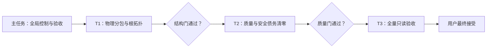

# Stage 9：物理前后端分离与根目录收口编排计划

> 批准日期：2026-08-13（Asia/Shanghai）
> 生产基线：`364aeb186ee79468b473a4f17689c2991e2b2fe3`
> 状态：用户已批准，等待 T1 从本文档提交启动
> 范围：工程物理分包、根目录所有权、非业务质量与安全债务；不含 Scope B

## 1. 目标与冻结边界

当前 Web、Fastify API、Worker 已经分进程、分镜像运行，但根目录仍同时承担 Web package 与 monorepo 编排职责。因此本阶段把完成标准提升为源码、依赖、配置、构建和发布所有权的物理分离。

最终结果必须同时满足：

1. Web 迁入 `apps/web` 并拥有独立 package、依赖、配置与构建入口；
2. 根 package 只负责编排，不直接拥有 Web runtime 依赖；
3. database、infrastructure、tooling、tests、docs、archive 具有明确单一所有权；
4. tracked 根一级条目由 40 降至不超过 24；
5. 18 个 legacy GET 保留薄 `410 + WRITER_MOVED + successor Link`，不可达旧主体退出 live source；
6. ESLint 达到 `0 errors / 0 warnings`；
7. migrator 不再注入整个 `.env.production`；
8. 生产依赖 audit 保持 0，全依赖树 Critical/High 降为 0；
9. 项目可控的 workspace-root、dynamic-import 与大 chunk warning 收口；
10. 不改变业务规则、公共 API、响应形状、权限矩阵、Schema、migration 字节、writer/command/resource identity、audit/outbox/Step-up/idempotency 语义或 Scope B。

原始文件和历史资产不得为了目录美观直接删除。tracked 历史文本采用 `git mv` 迁入 `docs/history`；legacy source 在退出 live source 前形成受控 source snapshot、manifest、hash 与 Docker/lint 排除证据；既有 343 项 archive 资产继续保持可恢复且不进入 Git/Docker context。

## 2. 目标目录

```text
/
├─ apps/
│  ├─ web/
│  │  ├─ app/
│  │  ├─ public/
│  │  ├─ platform/
│  │  ├─ types/
│  │  ├─ next.config.ts
│  │  ├─ vite.config.ts
│  │  ├─ postcss.config.mjs
│  │  ├─ tsconfig.json
│  │  └─ package.json
│  ├─ api/
│  └─ worker/
├─ packages/
│  ├─ contracts/
│  └─ shared-config/
├─ database/
│  ├─ schema/
│  ├─ runtime/
│  ├─ migrations/mysql/
│  ├─ migrations/d1/
│  └─ tooling/
├─ infrastructure/
│  ├─ docker/
│  ├─ aliyun/
│  └─ cloudflare/
├─ tooling/
│  ├─ build/
│  ├─ checks/
│  ├─ release/
│  └─ archive/
├─ tests/
├─ docs/refactor/
├─ docs/history/
├─ archive/
├─ vendor/
├─ .github/
├─ .openai/
├─ package.json
├─ pnpm-workspace.yaml
├─ pnpm-lock.yaml
├─ eslint.config.mjs
├─ tsconfig.json
├─ README.md
├─ CONTRIBUTING.md
└─ SECURITY.md
```

`.openai/hosting.json` 仅在 Sites 工具约定要求时保留根目录并登记例外。没有实际消费者时不得创建空的 `test-support`、repository、domain、CQRS 或通用 shared 包。

## 3. 结果拓扑



三个用户可见任务严格串行。路径搬迁、package 拆分和依赖升级会修改相同入口，禁止多个并行写者。每阶段可以使用最多两个内部只读 Agent 收集路径、依赖、安全与兼容证据，由唯一结果所有者吸收。

## 4. T1：实施-Web 物理分包与根目录拓扑收口

### 4.1 唯一结果与执行空间

- 从生产基线之上的本文档提交创建一个隔离 worktree；
- T1 是本阶段唯一写者，必须建立 Codex 原生 Goal；
- 使用宿主默认模型与推理设置；
- 主任务保留路径裁决、跨阶段接受和最终责任。

### 4.2 实施批次

1. 冻结路径、migration、release manifest、legacy route 与 Docker closure 清单；
2. 消除 `db -> app/lib` 四条反向依赖，只抽取有真实跨运行时消费者的最小 primitive；
3. 创建 `apps/web/package.json`，迁移 Web runtime 依赖和脚本；
4. 使用可审计 rename 移动 `app`、`public`、Web configs、Web ambient types 与 Cloudflare adapter；
5. 移动 database、Docker/Aliyun、tooling 与历史根文档；
6. 更新脚本、测试、Docker context、Next standalone、Vinext 与 Sites 路径；
7. 运行完整结构、构建、测试和 migration/release identity 验证。

### 4.3 GO 条件

- 根 package 不直接拥有 Next、React、Vinext、Vite 等 Web runtime 依赖；
- 根 `app`、`public`、Web configs 消失，Web package 可独立 build/typecheck/test；
- `database -> apps/web` 依赖为 0，运行时循环为 0；
- tracked 根一级条目不超过 24；
- MySQL/D1 migration SQL、snapshot、journal 原生字节不变；
- release manifest 的 migrations、35 commands、29 resources、generation=2 和 identity 不变；
- Web/API/Worker 独立构建、镜像和健康语义不变；
- archive 343 项 verify/restore dry-run 保持通过；
- 无业务、API、Schema、identity 或 Scope B 差量。

T1 结果就绪后停止生产，由主任务核对实际 SHA、父链、diff、root inventory、依赖闭包、构建、测试、worktree 与资源。合同内问题最多退回同一 T1 一次极窄修订。

## 5. T2：实施-非业务质量与安全债务清零

### 5.1 依赖与执行空间

- 仅从 accepted T1 SHA 创建新的隔离 worktree；
- T2 为唯一写者并建立原生 Goal；
- T1 未接受前不得创建 T2。

### 5.2 实施批次

1. 为退役路由旧主体形成精确 source snapshot、manifest、hash、敏感扫描与恢复证据；
2. 删除 live source 中 410 后的不可达主体，保留 18 个精确薄 410 入口；
3. 清除 legacy unused warnings；
4. 按组件修复 Hooks warning，覆盖重复请求和生命周期反例；
5. 拆分生产环境预检与 migration，migrator 改为显式最小环境变量 allowlist；
6. 按 ESLint、Wrangler/Undici、Vinext/Vite/RSC、Drizzle/esbuild 四个依赖簇串行升级；
7. 处理项目可控的 workspace-root、dynamic-import 与大 chunk warning。

### 5.3 GO 条件

- ESLint `0 errors / 0 warnings`，不得靠关闭规则、忽略 live source 或扩大 baseline 伪造；
- `pnpm audit --prod` 为 0，全树 Critical=0、High=0；
- Vinext 上游若没有无业务变化的安全路径，停止并把框架取舍交回用户；
- migrator 不使用 `env_file`，只接收显式 migration 所需变量；
- 18 个 legacy route 逐项保持 `410 + WRITER_MOVED + successor Link`；
- source snapshot 不参与 runtime、build、lint、Docker context 或发布；
- 项目可控构建 warning 为 0；第三方上游 warning 必须给出精确来源、影响和阻塞决策；
- 所有安全、事务、并发、migration、release 与兼容门保持通过。

T2 同样只有一次原任务极窄修订机会，不形成无界审查—修订循环。

## 6. T3：验收-物理分离与工程质量全量门禁

- 仅在 T1/T2 accepted 并线性集成后创建；
- 使用隔离 clean worktree和原生 Goal；
- 只读生产代码，唯一允许写入为 `docs/refactor` 中文最终验收报告；
- 不修生产代码、测试、配置、依赖、SQL 或 identity。

必须覆盖：

- 非标准目录 frozen install；
- Web/API/Worker/Contracts TypeScript；
- ESLint 0/0 与全量 audit；
- non-MySQL、真实 MySQL，禁止 skip；
- Next production 与 Vinext preview build；
- 三个 fresh Docker 镜像及 non-root/read-only/cap-drop/health；
- 三运行时独立 package、依赖闭包与镜像；
- migration fresh/upgrade/repeat 和原历史 hash；
- deploy/activation/rollback/audit/outbox/writer fence；
- 18 个 legacy 410；
- archive manifest、敏感扫描、restore dry-run；
- root inventory 和所有权；
- 无 OSS 凭据时 Web health 继续诚实 fail closed，不伪造绿色。

T3 只形成 GO/NO-GO 与失败分级。最终方向必须由用户接受，不自动启动 Scope B。

## 7. 主任务控制、监控与收尾

- 当前主任务保持 `主-` designation 和唯一控制权；
- 创建任务后立即核对实际 ID、host、标题、worktree、HEAD、clean、权限和原生 Goal；
- 正常推进保持安静，最大静默 20 分钟；里程碑、偏离、阻塞、审批、终态和阶段切换立即回报；
- 长期执行使用附着于主任务的 heartbeat，全部阶段终态后删除；
- 允许范围内的本地分支、worktree、精确提交、验证和 accepted commit 集成；
- 禁止未经另行授权的 push、PR、发布、部署、生产凭据、不可逆数据操作和未知资源删除；
- T1/T2 客观门通过后由主任务代为接受、线性集成、归档并清理精确 worktree；
- T3 与最终恢复现场在用户接受前保留；用户接受后再按精确清理门收尾。

## 8. 主要风险与升级条件

1. Vinext/Vite/RSC 可能没有无行为变化的 High advisory 修复路径；需要更换框架或放弃预览链时必须由用户裁决。
2. Sites `.openai` 根目录约定、Next standalone 和 Docker tracing 是 Web 搬迁最大兼容风险。
3. migration 允许移动路径但禁止改变任一已冻结字节、history 或 release contract。
4. 禁止借机新建通用大包、全仓格式化、重写业务状态机或进入 Scope B。
5. 权限档案回落、审批残留、合法业务全面阻断、生产凭据或不可逆操作出现时立即停止并通知用户。
